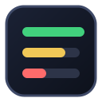
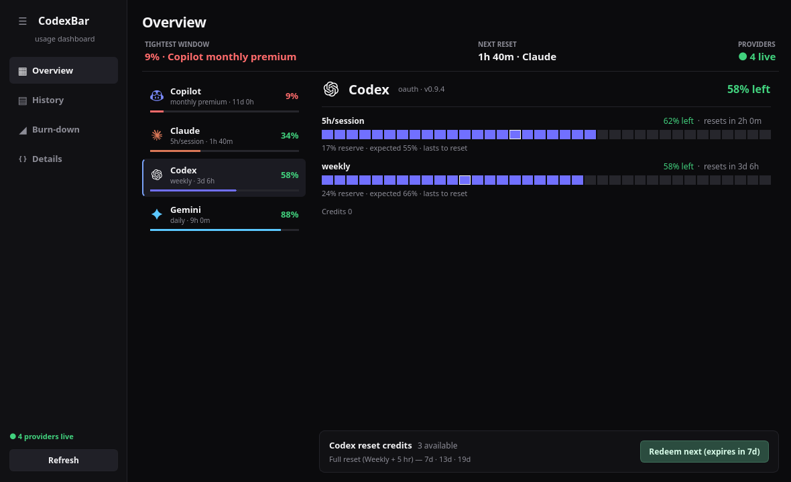
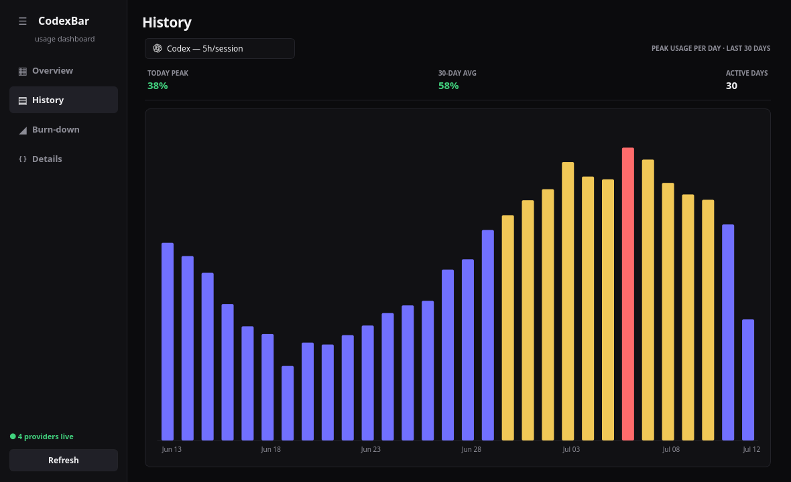
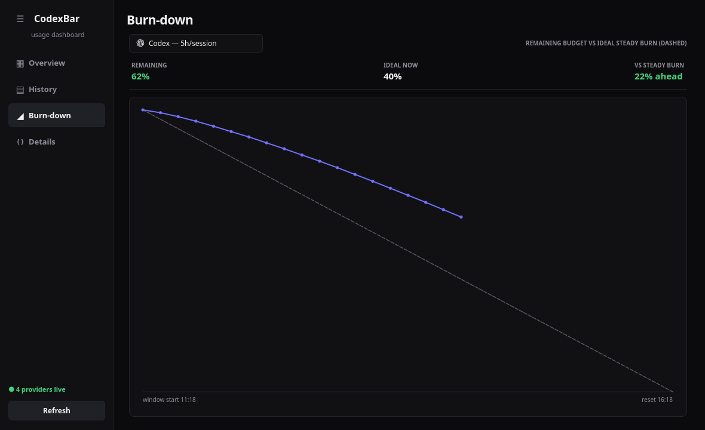
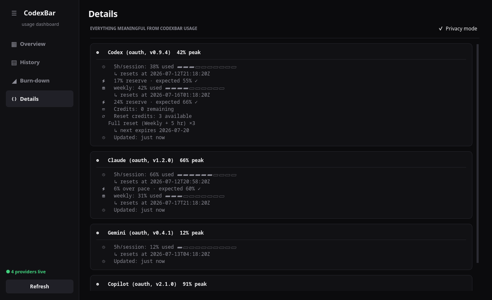

<div align="center">



# CodexBar KDE

**A local PyQt6 dashboard + tray app for AI subscription usage on KDE/Linux**

Built on top of the [CodexBar](https://codexbar.app) CLI (`codexbar usage --format json`).
All providers together, clear meters, history charts — no fragmented single-provider widgets.


<sub>*The optional Codex reset-credit redeem button is the single, user-confirmed exception — see [Privacy model](#privacy-model).</sub>

</div>

> This is an independent companion app — **not** the official CodexBar macOS app — in the
> same spirit as other unofficial Linux integrations (codexbar-waybar, KodexBar, Codexbar GNOME).

---

## Screenshots

*Rendered with synthetic demo data via [`scripts/make_screenshots.py`](scripts/make_screenshots.py).*

### Overview
Provider rail on the left (brand icon, tightest window, spark meter), fleet
aggregate strip on top, and a per-window stage with segmented block meters —
`N% left`, reset countdowns, pace markers. Codex adds a **reset credits** panel
with a one-click *Redeem next* button for the credit closest to expiring.



### History
Daily peak-usage bar chart (last 30 days) per provider window — each day's bar
takes the provider accent while healthy and amber/red once hot, so bad days
stand out at a glance.



### Burn-down
Remaining budget vs a dashed ideal steady-burn line for the active window, like
the CodexBar Burn Down widget.



### Details
Monospace compact dump of every meaningful `codexbar usage` field.



---

## Features

- **Flat dark CodexBar-inspired shell** — sidebar navigation, hairline separators,
  segmented block meters, no heavy cards (codexbar.app design language).
- **Collapsible sidebar** — `Ctrl+B` (or the ☰ button) collapses it to a 52px
  icon rail; the state persists across restarts.
- **Four statistic views** (Overview / History / Burn-down / Details) on
  `Ctrl+1`–`Ctrl+4`, each also reachable from the tray *Views* submenu.
- **One color system everywhere** — provider brand accents while a meter is
  healthy (<70% used), amber at 70–89%, red at 90%+; the same rule drives the
  Overview meters, History bars, Burn-down line, and tray severity dots.
- **System tray icon** with a glance-card tooltip:
  - One line per provider: severity dot (🟢🟡🔴), `N% left`, a unicode meter,
    and the next reset — plus a footer with the fleet's tightest window, next
    reset, and available Codex reset credits.
  - Severity dots track the exact Overview thresholds; KDE tray tooltips are
    plain text, so color arrives via color-emoji glyphs (see
    [Notes on tray tooltips](#notes-on-tray-tooltips)).
  - Click the tray icon to open the dashboard; right-click for Open / Refresh /
    Views / Quit.
- **Usage history** sampled on every refresh into
  `~/.local/state/codexbar-kde/history.jsonl` (JSONL, pruned to 60 days, corrupt
  lines skipped). Charts fill in as history accrues.
- **Resilient**: provider errors stay inline in Overview without hiding healthy
  providers.
- **Private by default**: account identity is masked in Details and the tray;
  the Details toggle can reveal identity deliberately, but credential-like
  values remain redacted in either mode.

## Install

**Option A — AppImage** (bundles Python + PyQt6; still needs `codexbar` on the host):

```sh
# download CodexBar_KDE-x86_64.AppImage from the Releases page, then:
chmod +x CodexBar_KDE-x86_64.AppImage
./CodexBar_KDE-x86_64.AppImage
```

The release AppImage is x86_64 and audited for a maximum `GLIBC_2.28`
requirement (for example, Debian 10+, Ubuntu 20.04+, and current Arch/CachyOS).
It intentionally uses the host graphics-dispatch stack, which must provide
`libEGL.so.1` and `libGL.so.1`, so hardware-specific drivers remain compatible.

**Option B — pip / pipx** (uses your system Qt platform plugins via the PyQt6 wheel):

```sh
pipx install git+https://github.com/BearHuddleston/codexbar-kde.git
```

Optional desktop integration (launcher entry + icon):

```sh
install -Dm644 packaging/io.github.BearHuddleston.codexbar_kde.desktop \
  ~/.local/share/applications/io.github.BearHuddleston.codexbar_kde.desktop
install -Dm644 assets/codexbar-kde.svg \
  ~/.local/share/icons/hicolor/scalable/apps/io.github.BearHuddleston.codexbar_kde.svg
kbuildsycoca6 --noincremental   # KDE: refresh the launcher cache
```

> The icon **must** be installed under the reverse-DNS name matching the
> window's `app_id` (`io.github.BearHuddleston.codexbar_kde`) — otherwise
> KWin on Wayland can't associate the window with the launcher and shows a
> generic icon in the titlebar and task manager.

Both options require the [CodexBar CLI](https://codexbar.app) at `/usr/bin/codexbar`
(or pass `--codexbar-bin PATH`).

## Usage

Run the dashboard (window + tray):

```sh
codexbar-kde
```

Privacy-safe terminal summary:

```sh
codexbar-kde --once
```

GUI smoke test (offscreen render of all views):

```sh
QT_QPA_PLATFORM=offscreen codexbar-kde --test-render
```

Useful flags:

| Flag | Effect |
| --- | --- |
| `--codexbar-bin PATH` | Path to the `codexbar` CLI (default `/usr/bin/codexbar`) |
| `--refresh-seconds N` | Auto-refresh interval (default 120, min 30) |
| `--no-tray` | Plain window only, no system tray icon |
| `--once` | Print a text summary and exit |
| `--test-render` | Build the UI offscreen once and exit |

## Privacy model

- Calls only `/usr/bin/codexbar usage --format json --json-only --pretty` by default.
- The Codex reset-credit **redeem** button additionally reads the OAuth token from
  `~/.codex/auth.json` (written by `codex login`) and POSTs to
  `https://chatgpt.com/backend-api/wham/rate-limit-reset-credits/consume` — the same
  endpoint the official Codex desktop/VS Code extension uses. It only spends credits
  OpenAI granted to the account; a confirmation dialog is required and nothing is
  redeemed automatically.
- Does **not** read provider token/cookie files directly.
- Does **not** store credentials.
- Local cost/log scanning is **not** used.
- Account identity is masked by default in Details and the tray tooltip. The
  Details-view privacy toggle can reveal identity, but credential-like values
  remain redacted regardless of that toggle.

## Notes on tray tooltips

KDE/QSystemTrayIcon tooltips are plain text, not full custom HTML/CSS popovers,
so per-character coloring is impossible. Severity therefore rides on color-font
emoji dots (🟢🟡🔴), which render in color anywhere a color emoji font (e.g.
Noto Color Emoji) is installed. The remaining glyph icons rely on a locally
installed Nerd Font fallback; without one they degrade to unknown-character
boxes but the text stays readable.

## Development

```sh
# Run tests (offscreen so no display is needed). Prefer pytest locally:
# tests/conftest.py sandboxes QSettings so runs never touch ~/.config.
QT_QPA_PLATFORM=offscreen PYTHONPATH=src python -m pytest tests/ -q
# The suite is also plain stdlib unittest (what CI runs):
QT_QPA_PLATFORM=offscreen PYTHONPATH=src python -m unittest discover -s tests -v

# Regenerate the README screenshots (synthetic data only — nothing personal leaks)
QT_QPA_PLATFORM=offscreen python scripts/make_screenshots.py

# Build a self-contained x86_64 AppImage (bundles Python + PyQt6, ~92 MB)
bash scripts/build_appimage.sh
# → dist/CodexBar_KDE-x86_64.AppImage

# Audit undefined ABI requirements in every embedded ELF plus the runtime
python scripts/audit_appimage.py dist/CodexBar_KDE-x86_64.AppImage
```

The AppImage bundles the Python runtime and PyQt6 but **not** the `codexbar`
CLI itself — it still expects `/usr/bin/codexbar` on the host (or pass
`--codexbar-bin PATH`).

The build uses checksum-pinned Python 3.11.14 manylinux_2_28 and appimagetool
1.9.1 assets plus three hash-locked PyQt6 wheels. Downloads are cached under
`${XDG_CACHE_HOME:-~/.cache}/codexbar-kde-appimage`; after one successful build,
`APPIMAGE_OFFLINE=1 bash scripts/build_appimage.sh` requires a complete verified
cache and performs no downloads. `SOURCE_DATE_EPOCH` defaults to the current Git
commit timestamp. CI builds twice, requires byte-identical output, smoke-tests
the final AppImage, and enforces `GLIBC_2.28`, `GLIBCXX_3.4.22`, and
`CXXABI_1.3.11` ceilings.

The project source is MIT-licensed. The AppImage uses the public GPLv3 build
of PyQt6 6.7.1—not a Riverbank commercial-license grant—so distribution of
the combined AppImage must satisfy GPLv3. The bundled Qt wheel contains
LGPLv3 components and some GPLv3 add-ons; PyQt6-sip and the Python runtime have
their own terms. Complete license texts, a third-party notice, and an SPDX 2.3
package SBOM are embedded in the image and emitted beside it. See
[`THIRD_PARTY_NOTICES.md`](THIRD_PARTY_NOTICES.md) for exact binary/source
URLs and hashes, and [`docs/appimage-licensing.md`](docs/appimage-licensing.md)
for the source-availability and release-sign-off checklist.

Layout:

```
src/codexbar_kde/
  app.py      # entry point, dashboard window, tray controller, tooltip builder
  model.py    # payload normalization into ProviderUsage / WindowUsage
  views.py    # Overview / History / Burn-down / Details widgets + theme
  history.py  # JSONL history store, daily peaks, burn-down series
  reset.py    # Codex reset-credit listing and redeem call
  assets/     # vendored provider icons (see THIRD_PARTY_NOTICES.md)
tests/        # unittest suite (model, history, reset, app, UI smoke)
              # conftest.py sandboxes QSettings for local pytest runs
```
